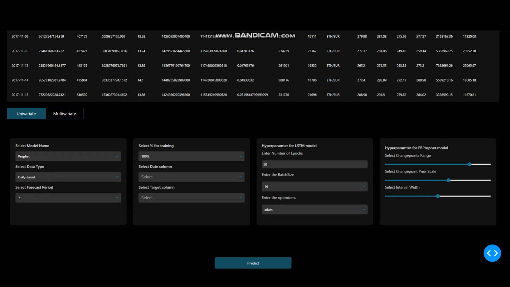
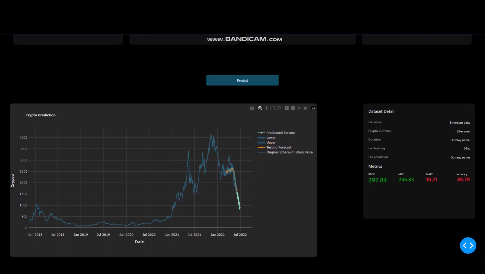

# Teading-Bot
 

INTRODUCTION

The application utilizes algorithmic trading for high-frequency stock market data, extracting live data from APIs. It calculates order flow imbalance (OFI) to predict future values, implements the Lee Ready algorithm for trade classification, and employs the VPIN algorithm to detect order flow toxicities.

TECNICALITIES/TOOLS USED

1. Python
2. Request (fetch data from APIs)
3. Dask(To handle large amount of data)
4. Pandas (for data manipulation and analysis)
5. Scikit-Learn (for machine learning models)
6. Tensorflow Keras (for deep learning models)
7. HTML (for web content structure)
8. CSS (for styling web content)

SYSTEM SCREENSHOTS

 
 
 

SYSTEM RECORDED VIDEO

LINK: https://youtube.com/watch?v=ctIxAX3lJD8
